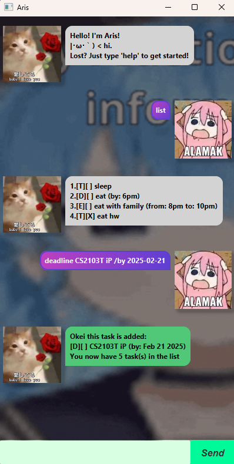

# 📌 Aris User Guide

### Welcome to **Aris**! This chatbot helps you manage tasks, set appointments, and more, all through an intuitive command-based system.

---

## 📋 Available Commands

| Command                                | Description                                | Example                                           |
|----------------------------------------|--------------------------------------------|---------------------------------------------------|
| `list`                                 | Displays all tasks                         | `list`                                            |
| `todo <task>`                          | Adds a new To-Do task                      | `todo Buy milk`                                   |
| `deadline <task> /by <date>`	          | Adds a task with a deadline	               | `deadline Project /by 2025-02-20`                 |
| `event <task> /from <date> /to <date>` | Adds an event task                         | 	`event Concert /from 2025-03-01 /to 2025-03-02 ` |
| `mark <index>`                         | Marks a task as completed	                 | `mark 1 `                                         |
| `unmark <index>`                       | Marks a task as incomplete	                | `unmark 1 `                                       |
| `delete <index>`                       | Deletes a task	                            | `delete 2 `                                       |
| `find <keyword>`	                      | Searches for tasks containing the keyword	 | `find milk  `                                     |
| `bye`	                                 | Exits the chatbot	                         | `bye  `                                           |
| `help`	                                | Opens the Help Window                      | 	`help  `                                         |
| `suisei`	                              | Opens a random Suisei YouTube video        | 	`suisei  `                                       |

---

## 🔥 Features
### ✅ 1. Task Management
+ Easily add, mark, and delete tasks.
+ Supports To-Do, Deadline, and Event task types.
### ✅ 2. Help System
+ Type help to open a Help Window with all available commands.
### ✅ 3. Fun Feature: Suisei Command
+ Type `suisei` to open a random Suisei YouTube video.
### ✅ 4. Data Persistence
+ Your tasks are automatically saved and reloaded when you restart the app.

---
## 🎯 Final Notes
This chatbot was designed to be simple, efficient, and fun. 
Enjoy using it, and if you have any feedback, feel free to contribute! 🎉